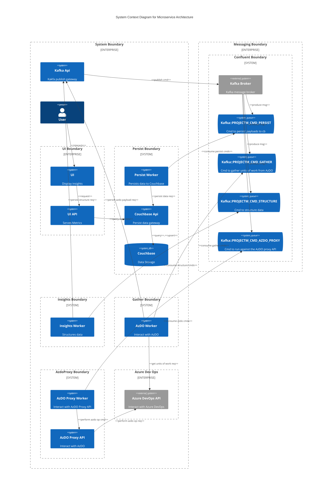

```mermaid
C4Context
  title System Context Diagram for Microservice Architecture

  Enterprise_Boundary(systemBoundary, "System Boundary") {

    Enterprise_Boundary(uiBoundary, "UI Boundary") {
      System(ui, "UI", "Display insights")
      System(uiApi, "UI API", "Serves Metrics")
    }

    System_Boundary(persistBoundary, "Persist Boundary"){
      System(persistWorker, "Persist Worker", "Persists data to Couchbase")
      System(couchbaseApi, "Couchbase Api", "Persist data gateway")
      SystemDb(couchbase, "Couchbase", "Data Storage")
    }

    System_Boundary(insightsBoundary, "Insights Boundary"){
      System(insightsWorker, "Insights Worker", "Structures data")
    }

    System_Boundary(gatherBoundary, "Gather Boundary") {
      System(azdoWorker, "AzDO Worker", "Interact with AzDO")
    }

    System_Boundary(azdoProxyBoundary, "AzdoProxy Boundary") {
      System(azdoProxyWorker, "AzDO Proxy Worker", "Interact with AzDO Proxy API")
      System(azdoProxyApi, "AzDO Proxy API", "Interact with AzDO")
    }

    Enterprise_Boundary(extAzdo, "Azure Dev Ops") {
      System_Ext(extAzdoApi, "Azure DevOps API", "Interact with Azure DevOps")
    }

    System(kafkaApi, "Kafka Api", "Kakfa publish gateway")

    Person(user, "User", "")
  }

  Enterprise_Boundary(messagingBoundary, "Messaging Boundary") {

    System_Boundary(confluentBoundary, "Confluent Boundary") {
      System_Ext(broker, "Kafka Broker", "Kafka message broker")
      SystemQueue(persistCmdTopic, "Kafka::PROJECTM_CMD_PERSIST", "Cmd to persist payloads to cb")
      SystemQueue(gatherCmdTopic, "Kafka::PROJECTM_CMD_GATHER", "Cmd to gather units of work from AzDO")
      SystemQueue(structureCmdTopic, "Kafka::PROJECTM_CMD_STRUCTURE", "Cmd to structure data")
      SystemQueue(azdoProxyCmdTopic, "Kafka::PROJECTM_CMD_AZDO_PROXY", "Cmd to run against the AzDO proxy API")
    }
  }

  Rel(user, ui, "<<interacts>>")
  Rel(ui, uiApi, "<<request>>")
  Rel(uiApi, couchbaseApi, "<<query read data>>")
  Rel(couchbaseApi, couchbase, "<<query>>,<<upsert>>")

  Rel(azdoWorker, gatherCmdTopic, "<<consume gather cmds>>")
  Rel(azdoWorker, kafkaApi, "<<persist azdo payload req>>")
  Rel(azdoWorker, extAzdoApi, "<<get units of work req>>")

  Rel(persistWorker, persistCmdTopic, "<<consume persist cmds>>")
  Rel(persistWorker, couchbaseApi, "<<persist data req>>")

  Rel(insightsWorker, structureCmdTopic, "<<consume structure cmds>>")
  Rel(insightsWorker, kafkaApi, "<<persist structure req>>")

  Rel(azdoProxyWorker, azdoProxyCmdTopic, "<<consume azdo cmds>>")
  Rel(azdoProxyWorker, azdoProxyApi, "<<perform azdo op cmd>>")
  Rel(azdoProxyApi, extAzdoApi, "<<perform azdo op req>>")

  Rel(kafkaApi, broker, "<<publish cmd>>")

  Rel(broker, persistCmdTopic, "<<produce msg>>")
  Rel(broker, gatherCmdTopic, "<<produce msg>>")
  Rel(broker, structureCmdTopic, "<<produce msg>>")
  Rel(broker, azdoProxyCmdTopic, "<<produce msg>>")

```
