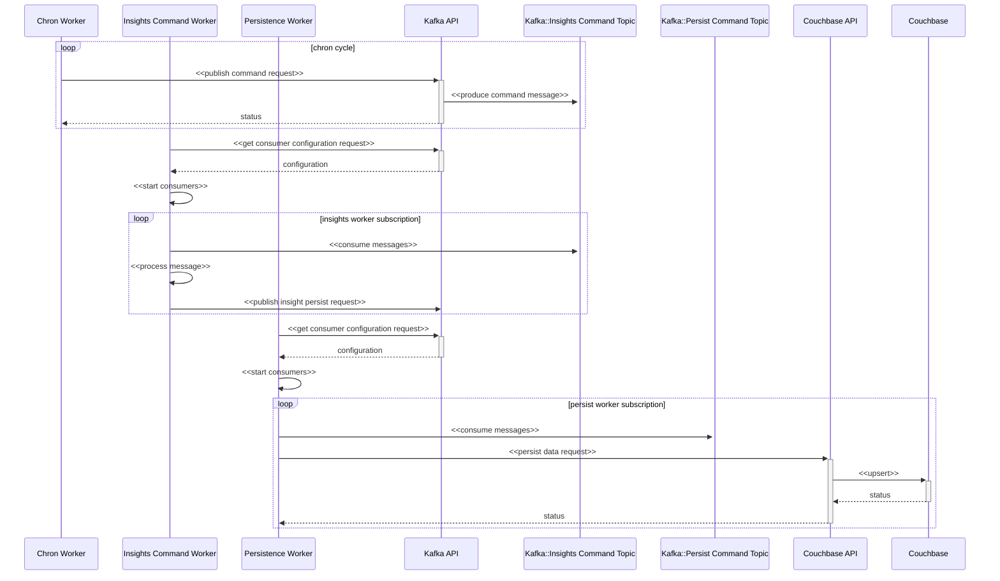

```mermaid
sequenceDiagram
  participant chronWorker as Chron Worker
  participant insightsWorker as Insights Command Worker
  participant persistWorker as Persistence Worker
  participant kafkaApi as Kafka API
  participant commandTopic as Kafka::Insights Command Topic
  participant persistTopic as Kafka::Persist Command Topic
  participant couchbaseApi as Couchbase API
  participant couchbase as Couchbase

  loop chron cycle
    chronWorker ->>+ kafkaApi: <<publish command request>>
    kafkaApi ->>+ commandTopic: <<produce command message>>
    kafkaApi -->>- chronWorker: status
  end

  insightsWorker ->>+ kafkaApi: <<get consumer configuration request>>
  kafkaApi -->>- insightsWorker: configuration
  insightsWorker ->> insightsWorker: <<start consumers>>

  loop insights worker subscription
    insightsWorker ->>+ commandTopic: <<consume messages>>
    insightsWorker ->> insightsWorker: <<process message>>
    insightsWorker ->> kafkaApi: <<publish insight persist request>>
  end

  persistWorker ->>+ kafkaApi: <<get consumer configuration request>>
  kafkaApi -->>- persistWorker: configuration
  persistWorker ->> persistWorker: <<start consumers>>

  loop persist worker subscription
    persistWorker ->>+ persistTopic: <<consume messages>>
    persistWorker ->>+ couchbaseApi: <<persist data request>>
    couchbaseApi ->>+ couchbase: <<upsert>>
    couchbase -->>- couchbaseApi: status
    couchbaseApi -->>- persistWorker: status
  end

```
