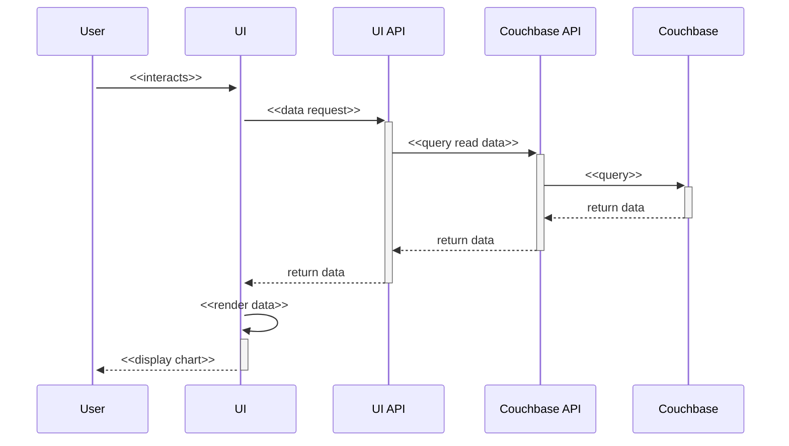

```mermaid
sequenceDiagram
  participant user as User
  participant ui as UI
  participant uiApi as UI API
  participant couchbaseApi as Couchbase API
  participant couchbase as Couchbase

  activate user

  user ->>+ ui: <<interacts>>
  ui ->>+ uiApi: <<data request>>
  uiApi ->>+ couchbaseApi: <<query read data>>
  couchbaseApi ->>+ couchbase: <<query>>
  couchbase -->>- couchbaseApi: return data
  couchbaseApi -->>- uiApi: return data
  uiApi -->>- ui: return data
  ui ->>+ ui: <<render data>>
  ui -->>- user: <<display chart>>
```
